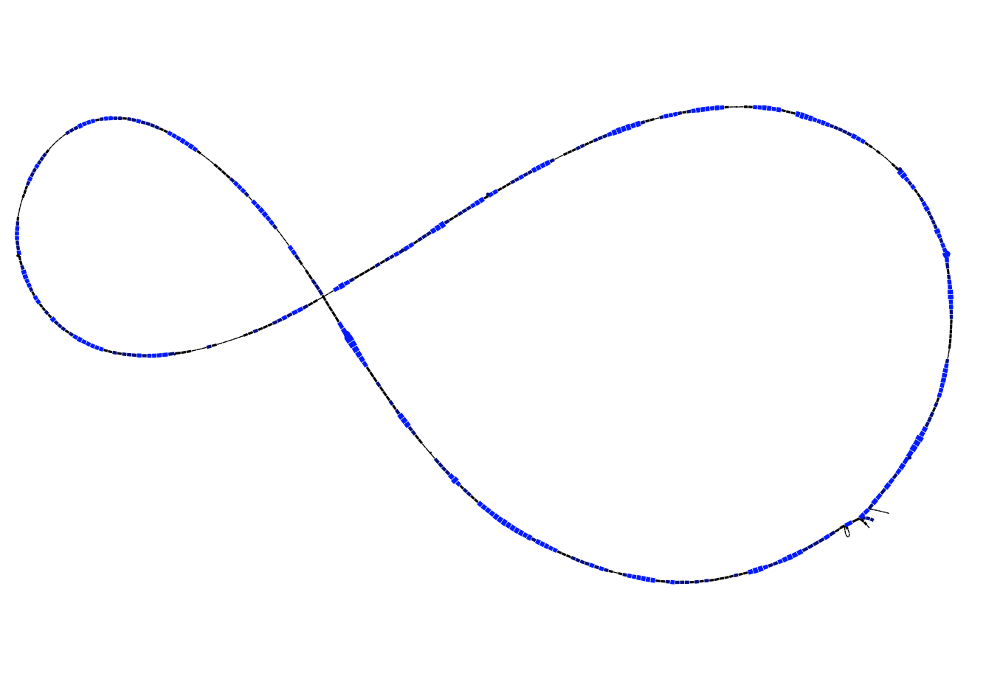
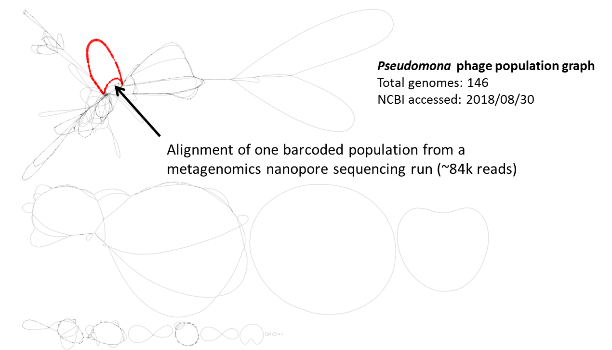

# PTOLEMY

Ptolemy is a reference-free approach for analysing microbial genome architectures, particularly, to study gene and structural diversity. In a nutshell, it uses a "top-down" approach to align multiple genomes via synteny analysis. The output is a gene-based population genome graph describing genes and structural variants that are unique/shared across a population. You can read more about it in our [publication](https://academic.oup.com/bioinformatics/article/34/17/i732/5093246).

The software requires a set of FASTA-formatted-assemblies and corresponding GFF-formatted-annotations, outputting a canonical-quiver with a gene representation. The graph is stored as a [GFA-formatted file](https://github.com/GFA-spec/GFA-spec/blob/master/GFA1.md) and can be visualized via graph-visualizers such as [Bandage](https://rrwick.github.io/Bandage/).

## Getting Started

These instructions will get you a copy of Ptolemy running on your local machine for development and use. 

### Prerequisites and dependencies

Ptolemy requires [minimap2](https://github.com/lh3/minimap2) for performing pairwise gene-alignment during the database creation step and syntenic anchoring. Once installed don't forget to [add the installation folder](https://github.com/AbeelLab/ptolemy/issues/5#issuecomment-577418660) to the PATH evironment variable to ensure that the tool is accessible for Ptolemy. 

### Executable JAR

No installation is required. Precompiled executable `.jar` files are directly available under [Releases](https://github.com/AbeelLab/ptolemy/releases/latest).

### Scala code compilation

Otherwise, the source code can also be compiled with the `build.sbt` provided, by running an appropiate `sbt` installation within the downloaded repository:

```
sbt assembly
sbt package
```

## Typical workflow

For a graph creation with Ptolemy, a *tab-separated* file is required, containing for each one of the genomes an unique sample identifier, FASTA assembly and GFF gene-annotations path. This file should look like:

```
Genome1 path/to/assembly/genome1.fa path/to/annotations/genome1.gff
Genome2 path/to/assembly/genome2.fa path/to/annotations/genome2.gff
Genome3 path/to/assembly/genome3.fa path/to/annotations/genome3.gff
```

For more information, refer to the provided sample [file](./testing_data/genome_list.txt).

Based on this file, three steps should be carried out to generate the graph in this order:
1. **Database creation:** the internal Ptolemy database is created. The command with the obligatory arguments looks like:
    ```
    java -jar ptolemy.jar extract -g <tab-file> -o <database-folder>
    ```
    The database folder will be created if it doesnt' exist. For a more detailed description of all the available flags, please run `java -jar ptolemy.jar extract` on the command line. 
  
2. **Multiple-genome alignment via syntenic anchoring:** based on the generated database, syntenic anchoring is performed with:
    ```
    java -jar ptolemy.jar syntenic-anchors -d <database-folder> -o <output-directory>
    ```
    During this step, parameters for an eventual long-read alignment process should be provided so that the graph is consistent with the alignment. All the flags can be retrieved with `java -jar ptolemy.jar syntenic-anchors`. 

3. **Canonical graph construction:** with the syntenic anchors generated, the graph in `.gfa` format can be generated with: 
    ```
    java -jar ptolemy.jar canonical-quiver -s <syntenic-anchors-file> -d <database-folder> -o <output-directory>
    ```
    Again, a full list with all flags and parameters can be obtained by running `java -jar ptolemy.jar canonical-quiver`. 


Once the graph is generated, long-read alignment can be performed with two different steps:

4. **Index canonical quiver**: different graph indexing operations are performed to provide a fast alignment process. To execute this step, run: 
    ```
    java -jar ptolemy.jar index-graph -c <canonical-quiver-gfa-file> -d <database-folder> 
    ```
    This is step is high-RAM resource consuming. A list of all possible parameters can be retrieved with `java -jar ptolemy.jar index-graph`, although some parameters have been already specified in the `syntenic-anchors` step and cannot be modified for consistency reasons.  
    
5. **Long-read alignment:** long-reads (either in FASTA or FASTQ format) can be aligned against the generated graph by running:
    ```
    java -jar ptolemy.jar align-reads -r <reads-file> -c <canonical-quiver-gfa-file> -d <database-folder> -o <output-directory> -p <prefix-output-files>
    ```
    The last flag allows the user to specify a straing that will be used as prefix the generated files (so multiple alignments can be stored in the same folder by using different prefixed). The optional arguments are shown by running `java -jar ptolemy.jar align-reads`.

## Installation testing

The code of the repository is bundled with a [folder](./testing_data/) that contains full [Pacbio assemblies](https://yjx1217.github.io/Yeast_PacBio_2016/data/) of a single yeast chromosome for three genomes and simulated reads from these three yeast strains. The following snippet serves to check the installation and see the results of a basic workflow. It should be executed in the root repository folder with the precompiled `.jar` file on it:
```
# graph construction
java -jar ptolemy.jar extract -g ./testing_data/genome_list.txt -o ptolemy_db/
java -jar ptolemy.jar syntenic-anchors -d ./ptolemy_db/ -o  ./
java -jar ptolemy.jar canonical-quiver -s ./syntenic_anchors.txt -d ./ptolemy_db/ -o ./

# long-read alignment
java -jar ptolemy.jar index-graph -c ./canonical_quiver.gfa -d ./ptolemy_db/
java -jar ptolemy.jar align-reads -r ./testing_data/reads.fasta -c ./canonical_quiver.gfa -d ./ptolemy_db/ -o ./ -p alignment

```

After running these commands, different outputs are obtained. The ones of interest are:

* `canonical_quiver.gfa`: graph generated in step 3, it can be analyzed with any `.gfa`-capable tool and visualized with sooftwares as [Bandage](https://rrwick.github.io/Bandage/). When performing statistics, it should be noted that the sequence is not stored in the `S` (segment) field of the `.gfa` file (having `N` for all nodes), given that the nodes may represent sequences of different lengths.
* `canonical_quiver.strains.out`: matrix table with graph-nodes-index as rows and assembly-strain-identifiers as columns, using 1 and 0 to show the presence of a strain in a node. It can  be used as a comprehensive way to retrieve graph information, as the amount of shared nodes between strains. 
* `alignment.static.gfa`: when long-read alignment is performed, this file contains the same nodes (`S` field) and edges (`L` field) as the `canonical_quiver.gfa`, including the depth of the reads as the fragment count and the alignment results in the `P` field (having a mapping between read and aligned node). It is a valid `.gfa` file that can be opened and analyzed with `.gfa`-capable tools. 
* `alignment.dynamics.gfa`: reduced-size based on the previous file, containing only the `P` field (i.e. the mapping between reads and nodes). Thus it is not `.gfa` format compliant file, as it is misssing the `S` and `L` fields. However, it can be handy specially due to its light weight. 
* `alignment.genes.gfa`: it contains the same information of the `alignment.dynamics.gfa` file but it replaces the identifier of the aligned nodes with the identifier of the genes that the aligned node represents. It is not `.gfa` compliant but it provides a useful mapping between reads and genes.    
* `alignment.strains.out`: matrix-table, similar to `canonical-quiver.gfa` but having the read-identifiers as rows and the strains as columns (using 1 and 0 to show the strain to which a given read aligns). It can be used for postprocessing, e.g., getting number of reads aligned to a given intersection of strains. 

For example, visualizing the resulting `alignment.static.gfa` from the testing data produces an image like the one below, where both color and node width represents the depth of the read alignment step. 



## License
This project is licensed under the GNU General Public License v3.0 license. See the [LICENSE](LICENSE) file for details

# Real scenario usage of Ptolemy

The graph-alignment feature of Ptolemy has been used to study genome architectures of bacteria-phages. The project consisted on using Ptolemy to build a gene-based population genome graph of different available bacteria-phage genomes. Long-reads from a metagenomic sequencing run were then aligned to identify existing/new architectures. The graph was generated with all 146 available *Pseudomonas*-phage genomes from NCBI, followed by alignment of a barcoded sample from a metagenomics Nanopore sequencing run generated by [undergraduate bachelor students](https://twitter.com/ThomasAbeel/status/1004303927616000000):


